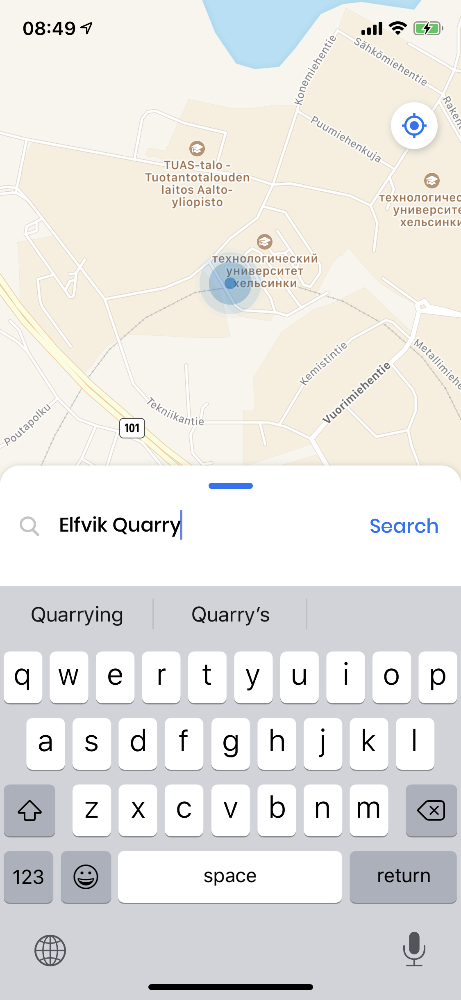
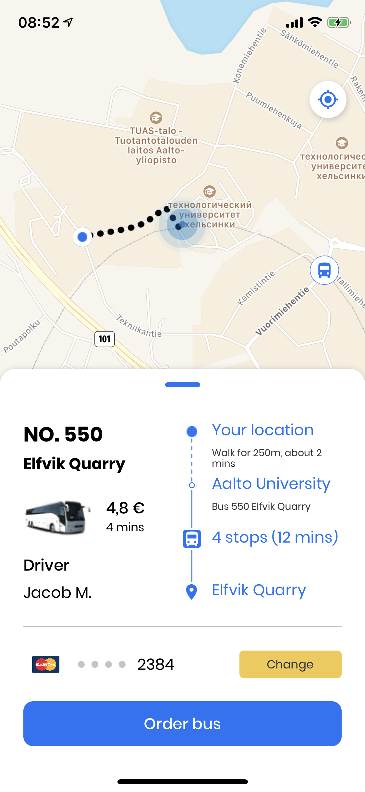
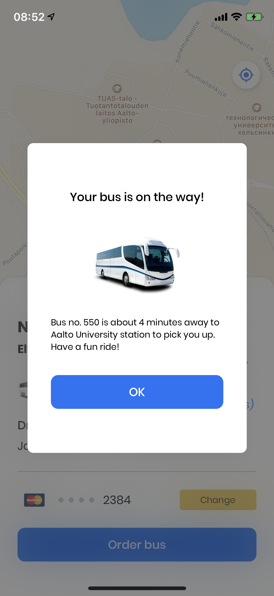
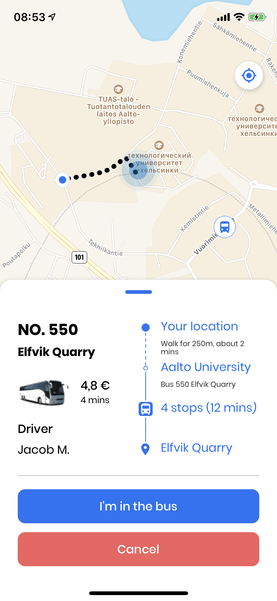

    

**Buber** is a mobile app for end-users that can help them not just only find their bus to travel but also adjust the demand and make the bus arrive faster.

Made during Junction 2019 hackathon.

   
